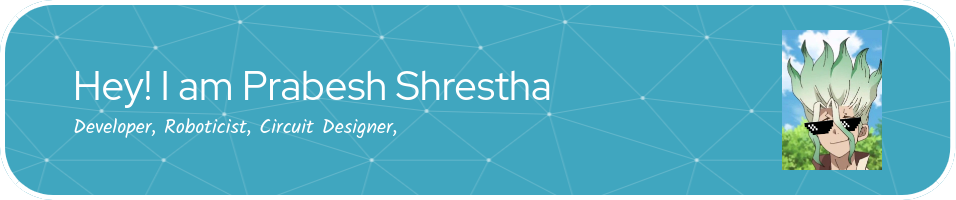

<!-- <h1 align="center">Hi 👋, I'm Prabesh Shrestha</h1>
<h3 align="center">A passionate Roboticist and a Programmer</h3>

-   📫 How to reach me **Prabesh.sh#1395 => Discord**

<h3 align="left">Languages and Tools:</h3>

                  

 -->

## Connect with me  

  

  
  

   

