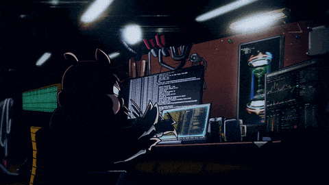

<h1 align="center">Hi 👋, I'm Prabesh Shrestha</h1>

<!--About Me-->

## <picture></picture> About me

<picture> </picture>

-   :brain: Passionate about Maths, Machines and Robots
-   :technologist: I use **Arch Linux, Neovim, Rust BTW**
-   :boom: You can visit [my website](https://prabesh-shrestha.com.np) for some frontend knowledge
-   :email: Feel free to **reach me out** 

 

<table border="0" align="center">
<tr border="0">
<td width="50%" align="center">
  
   
   
  
</td>

<td width="50%" align="center">

  
  
  </td>
</tr>
</table>

  
<a>
  
  
  
</a>
  
  
  
  
  
  
  
  
  
  
  
  

